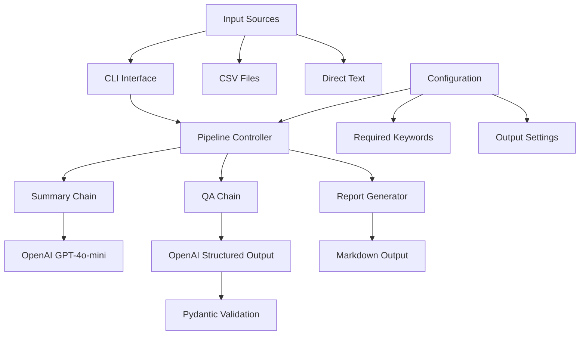

# Design Document

## Overview

The Deal Summary & QA Bot is designed as a modular Python application that leverages LangChain for orchestration and OpenAI's structured outputs for reliable data extraction. The system follows a pipeline architecture where raw text flows through summary generation and quality assurance validation stages, producing both human-readable summaries and machine-readable QA reports.

The architecture emphasizes separation of concerns with distinct modules for schemas, prompts, pipeline logic, and CLI interface. This design enables easy testing, maintenance, and future extensibility.

## Architecture



### Core Components

1. **Input Layer**: Handles CSV files and direct text input
2. **Pipeline Layer**: Orchestrates summary and QA processing
3. **LLM Integration**: Manages OpenAI API calls with structured outputs
4. **Validation Layer**: Ensures data integrity with Pydantic models
5. **Output Layer**: Generates formatted Markdown reports

## Components and Interfaces

### Schema Module (`schemas.py`)

**Purpose**: Defines Pydantic models for structured data validation

**Key Components**:
- `QAResult`: Main validation result model with strict typing
- Field validation for URLs, numeric values, and boolean flags
- JSON schema generation for OpenAI structured outputs

**Interface**:
```python
class QAResult(BaseModel):
    has_price: bool
    price_value: Optional[float]
    has_source_url: bool
    source_url: Optional[HttpUrl]
    within_length_limit: bool
    missing_keywords: List[str]
    duplicate_suspect: bool
    notes: Optional[str]
```

### Prompts Module (`prompts.py`)

**Purpose**: Centralizes all LLM prompt templates

**Key Components**:
- `SUMMARY_SYSTEM`: System prompt for summary generation with strict rules
- `SUMMARY_USER`: User prompt template for deal text input
- `QA_SYSTEM`: System prompt for structured validation
- `QA_USER`: User prompt template with validation rules

**Design Decisions**:
- Separate system and user prompts for better prompt engineering
- Template variables for dynamic content injection
- Clear rule specification for consistent outputs

### Pipeline Module (`pipeline.py`)

**Purpose**: Core processing logic and LangChain integration

**Key Components**:
- LLM initialization with appropriate temperature settings
- Summary chain using standard text output
- QA chain using structured output with Pydantic binding
- Combined processing function for end-to-end workflow

**Architecture Pattern**: Chain of Responsibility
- Each chain handles a specific aspect of processing
- Parallel execution where possible
- Error handling at chain boundaries

**Interface**:
```python
def analyze_deal(deal_text: str, required_keywords: List[str]) -> dict:
    # Returns: {"summary": str, "qa": dict}
```

### CLI Module (`cli.py`)

**Purpose**: Command-line interface and batch processing

**Key Components**:
- Argument parsing for flexible input options
- CSV processing with error handling
- Report generation and file output
- Progress indication for batch operations

**Supported Operations**:
- Single text processing: `--text "deal content"`
- CSV batch processing: `--input_csv deals.csv`
- Custom keyword specification: `--keywords deal discount euro`
- Output file configuration: `--out custom_report.md`

## Data Models

### Input Data Model

```python
# CSV Input Format
{
    "text": str  # Required column containing deal text
}

# Direct Input Format
deal_text: str  # Raw text string
```

### Processing Data Model

```python
# Internal processing structure
{
    "deal_text": str,
    "required_keywords": List[str],
    "summary": str,
    "qa_result": QAResult
}
```

### Output Data Model

```python
# Final output structure
{
    "summary": str,  # 180-220 char social-ready summary
    "qa": {
        "has_price": bool,
        "price_value": Optional[float],
        "has_source_url": bool,
        "source_url": Optional[str],
        "within_length_limit": bool,
        "missing_keywords": List[str],
        "duplicate_suspect": bool,
        "notes": Optional[str]
    }
}
```

## Error Handling

### LLM API Errors
- **Rate Limiting**: Implement exponential backoff with jitter
- **API Failures**: Retry logic with circuit breaker pattern
- **Invalid Responses**: Fallback to basic text parsing for QA validation
- **Token Limits**: Text truncation with preservation of key content

### Input Validation Errors
- **Missing CSV Columns**: Clear error messages with expected format
- **Invalid File Paths**: File existence checks with helpful suggestions
- **Empty Content**: Graceful handling with appropriate warnings
- **Encoding Issues**: UTF-8 fallback with error reporting

### Structured Output Errors
- **Schema Violations**: Pydantic validation with detailed error messages
- **Type Conversion**: Safe conversion with default values
- **Missing Fields**: Required field validation with clear feedback

### File System Errors
- **Permission Issues**: Clear error messages with suggested solutions
- **Disk Space**: Graceful degradation with minimal output options
- **Path Resolution**: Absolute path conversion with validation

## Testing Strategy

### Unit Testing
- **Schema Validation**: Test all Pydantic models with valid/invalid data
- **Prompt Templates**: Verify template rendering with various inputs
- **Pipeline Functions**: Mock LLM responses for deterministic testing
- **CLI Argument Parsing**: Test all command-line combinations

### Integration Testing
- **LangChain Integration**: Test chain execution with mock LLM
- **OpenAI API Integration**: Test structured output parsing
- **File I/O Operations**: Test CSV reading and Markdown writing
- **End-to-End Workflows**: Test complete processing pipelines

### Performance Testing
- **Batch Processing**: Test with large CSV files (1000+ rows)
- **Memory Usage**: Monitor memory consumption during processing
- **API Rate Limits**: Test behavior under rate limiting conditions
- **Concurrent Processing**: Validate thread safety if implemented

### Quality Assurance Testing
- **Summary Quality**: Validate character limits and content rules
- **QA Accuracy**: Test validation logic with known good/bad examples
- **Keyword Detection**: Test case-insensitive matching with edge cases
- **Duplicate Detection**: Validate pattern matching algorithms

### Test Data Strategy
- **Synthetic Data**: Generated test cases covering all validation scenarios
- **Real-world Samples**: Anonymized deal content for realistic testing
- **Edge Cases**: Malformed input, extreme lengths, special characters
- **Regression Tests**: Maintain test suite for bug prevention

### Continuous Testing
- **Automated Test Runs**: GitHub Actions or similar CI/CD integration
- **LLM Response Monitoring**: Track output quality over time
- **Performance Benchmarks**: Monitor processing speed and accuracy
- **Error Rate Tracking**: Alert on increased failure rates